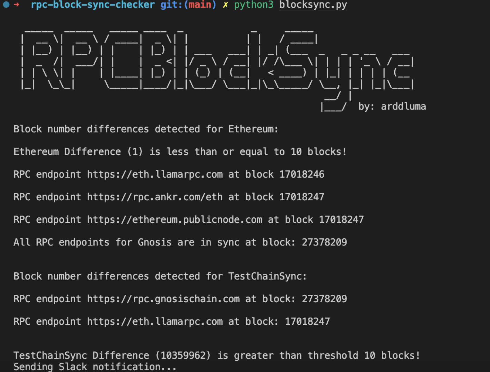

# RPC Block Sync Checker

Python script to check block sync of RPC endpoints, sends slack notification when difference is greater than threshold.

## Usage 

Add required RPC endpoints to `rpc_endpoints.txt` list as follows:

Label(Chain):RPC1;RPC2 (make sure you use delimiter `:` for chain and `;` for RPCs)

Example:
```
Ethereum:https://eth.llamarpc.com;https://rpc.ankr.com/eth;https://ethereum.publicnode.com
```

Add Slack webhook URL

Follow guide here https://api.slack.com/messaging/webhooks and replace `slack_webhook_url` line 78

Run the script

```
python3 blocksync.py
```
<figure>
    
    <figcaption>
        Example when RPCs are in sync,difference is lower than threshold and when is greater than threshold (10)
    </figcaption>
</figure>
